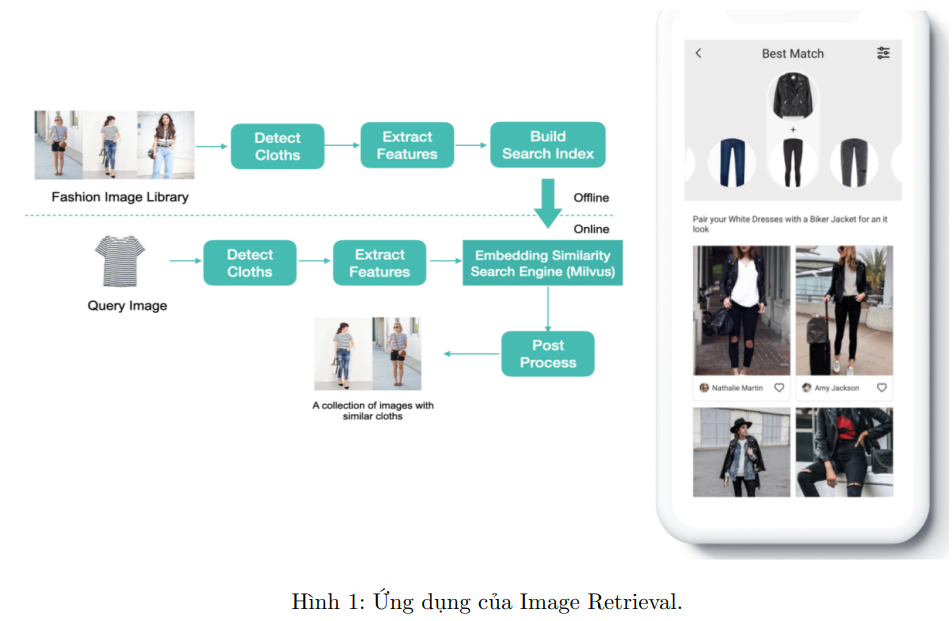
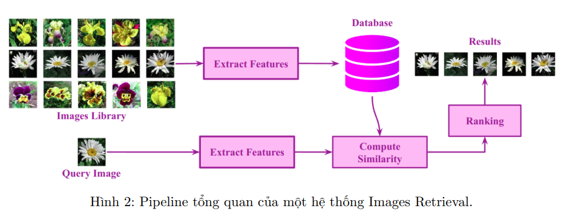
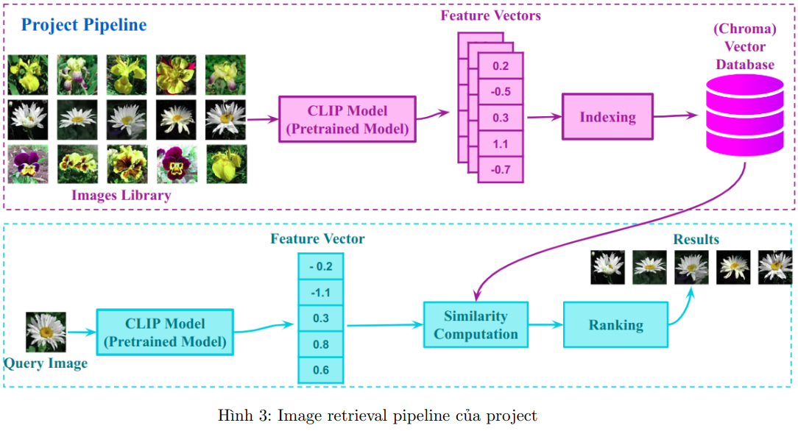

# Image-Retrieval
## Giới thiệu
Truy vấn hình ảnh (Images Retrieval) là một bài toán thuộc lĩnh vực Truy vấn thông tin (Information Retrieval). Trong đó, nhiệm vụ của ta là xây dựng một chương trình trả về các hình ảnh (Images) có liên quan đến hình ảnh truy vấn đầu vào(Query) và các hình ảnh được lấy từ một bộ dữ liệu hình ảnh cho trước, hiện nay có một số ứng dụng truy vấn ảnh như: Google Search Image, chức năng tìm kiếm sản phẩm bằng hình ảnh trên Shopee, Lazada, Tiki, ...

## Pipeline
Có rất nhiều cách thiết kế hệ thống truy vấn hình ảnh khác nhau, tuy nhiên về mặt tổng quát sẽ có pipeline như sau:

Input/Output của một hệ thống truy vấn hình ảnh bao gồm:
* Input: Hình ảnh truy vấn Query Image và bộ dữ liệu Images Library.
* Output: Danh sách các hình ảnh có sự tương tự đến hình ảnh truy vấn.

Trong dự án này, chúng ta sẽ xây dựng một hệ thống truy xuất hình ảnh bằng cách sử dụng mô hình deep learning đã được huấn luyện trước (CLIP) để trích xuất đặc trưng của ảnh và thu được các vector đặc trưng. Sau đó, chúng ta sẽ sử dụng vector database (Chroma) để index, lưu trữ và truy xuất các ảnh tương tự với ảnh yêu cầu thông qua các thuật toán đo độ tương đồng.

## Mục tiêu của dự án
Các mục tiêu chính của dự án bao gồm:
* Xây dựng chương trình truy vấn ảnh cơ bản.
* Phát triển chương trình truy vấn ảnh nâng cao với CLIP model và vector database.
* Thu thập và xử lý dữ liệu nhằm mục đích xây dựng chương trình truy vấn ảnh cá nhân hóa.

## Một vài phương pháp đo mức độ tương đồng giữa hai vector dùng trong project
### L1
$  L1(\vec{a},\vec{b}) = \displaystyle \sum_{i=1}^{N}|a - b| $

### L2
$ L2(\vec{a},\vec{b}) = \displaystyle \sqrt{\sum_{i=1}^{N}|(a_i - b_i)^2}$

### Cosine Similarity
$cosine\_ similarity(\vec{a},\vec{b}) = \displaystyle\frac{a \cdot b}{\left\| a\right\|\left\| b\right\|} = \frac{\sum_{i=1}^{N}a_ib_i}{\sqrt{\sum_{i=1}^{N}a_i^2}\sqrt{\sum_{i=1}^{N}b_i^2}}$

### Correlation Coefficient
$r = \displaystyle \frac{E[(X - \mu_X)(Y - \mu_Y)]}{\sigma_X\sigma_Y} = \frac{\sum (x_i - \mu_X)(y_i - \mu_Y)}{\sqrt{\sum (x_i - \mu_X)^2\sum (y_i - \mu_Y)^2}}$

# Setup development enviroment
1. Install `virtualenv` package that support to create virtual enviroment (if not install yet):
>pip install virtualenv

2. Create virtual environment named `env`
>py -m venv env

3. Activate the virtual environment
>Set-ExecutionPolicy Unrestricted -Scope Process    # run this command if get error UnauthorizedAccess when activating
>env\Scripts\activate

4. Install packages defined in requirements.txt
>pip install -r requirements.txt

5. Deactivate the virtual environment when finish
>deactivate